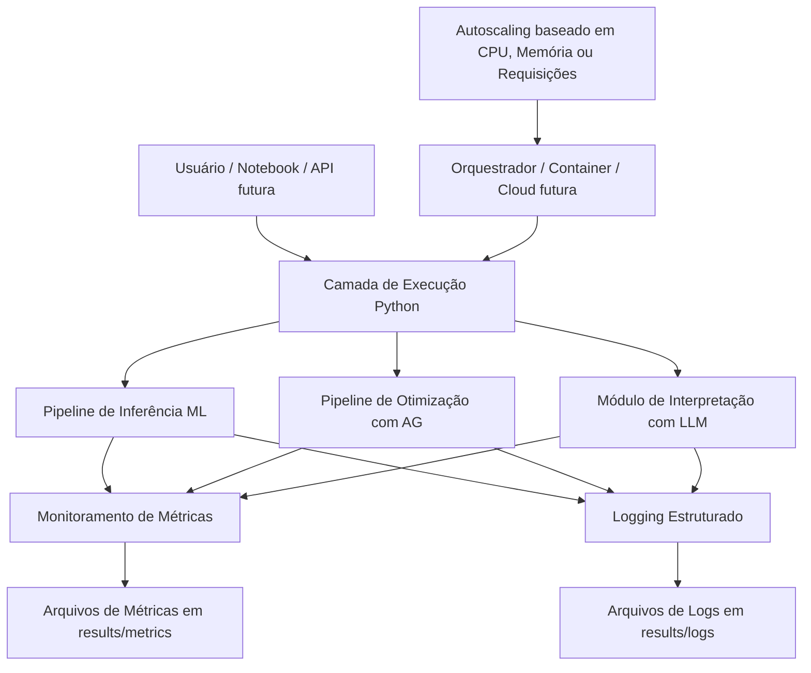

# Escalabilidade Automática, Monitoramento e Logging

## 1. Objetivo

Este documento descreve a estratégia proposta para escalabilidade automática, monitoramento e logging da solução de otimização de modelos de diagnóstico médico desenvolvida no Tech Challenge Fase 2.

A solução tem como foco permitir que o sistema suporte variações de demanda durante tarefas de:

- Treinamento e otimização com Algoritmos Genéticos;
- Execução de inferências com modelos de Machine Learning;
- Geração de explicações em linguagem natural com LLMs;
- Registro e análise de métricas de desempenho.

A implementação em nuvem é opcional neste desafio. Portanto, este projeto adota uma arquitetura preparada para execução local ou containerizada, com documentação clara de como evoluir para uma implantação em nuvem com autoscaling.

---

## 2. Visão Geral da Arquitetura

A arquitetura proposta é composta pelos seguintes blocos:



---

## 3. Estratégia de Escalabilidade Automática

### 3.1 Cenário atual

Atualmente, o projeto é executado principalmente via notebooks e scripts Python utilizando o gerenciador de ambiente `uv`.

A escalabilidade automática pode ser planejada em duas camadas:

1. **Escalabilidade horizontal da camada de inferência**
   - Múltiplas instâncias do serviço de predição podem ser executadas em paralelo.
   - Um balanceador de carga distribui as requisições entre as instâncias.
   - Ideal para cenários com aumento de acessos simultâneos.

2. **Escalabilidade assíncrona para tarefas pesadas**
   - Execuções longas, como otimização por Algoritmos Genéticos, podem ser tratadas como jobs.
   - Esses jobs podem ser colocados em uma fila e processados por workers.
   - O número de workers pode aumentar ou diminuir conforme o tamanho da fila.

---

## 4. Estratégia Local/Containerizada

Mesmo sem cloud, é possível preparar o projeto para escalabilidade usando containers.

Uma configuração recomendada seria:

- Um container para a aplicação Python;
- Um volume para persistir logs, métricas e artefatos;
- Variáveis de ambiente para controlar número de workers;
- Execução paralela de experimentos quando necessário.

Exemplo conceitual:

```text
Aplicação Python
├── Worker 1: inferência
├── Worker 2: inferência
├── Worker 3: otimização AG
└── Volume compartilhado:
    ├── results/logs
    ├── results/metrics
    └── results/artifacts
```

---

## 5. Estratégia em Nuvem

Caso o projeto seja implantado em cloud, a arquitetura pode ser evoluída para:

### AWS

- **ECS ou EKS** para executar containers;
- **Application Load Balancer** para distribuir requisições;
- **Auto Scaling Group** baseado em CPU, memória ou número de requisições;
- **CloudWatch** para logs e métricas;
- **S3** para armazenamento de modelos, métricas e artefatos.

### Google Cloud

- **Cloud Run** para execução serverless containerizada;
- **Cloud Monitoring** para métricas;
- **Cloud Logging** para logs;
- **Cloud Storage** para artefatos e modelos.

### Azure

- **Azure Container Apps** ou **AKS** para containers;
- **Azure Monitor** para métricas;
- **Log Analytics** para logs;
- **Blob Storage** para artefatos.

---

## 6. Política de Autoscaling Proposta

A política de autoscaling recomendada considera os seguintes sinais:

| Métrica | Ação |
|---|---|
| CPU média acima de 70% por 5 minutos | Adicionar uma instância |
| Memória acima de 75% por 5 minutos | Adicionar uma instância |
| Fila de jobs maior que 10 tarefas | Adicionar workers |
| Latência média acima de 2 segundos | Adicionar instância de inferência |
| CPU abaixo de 30% por 10 minutos | Remover instância |

Exemplo de política:

```text
Mínimo de instâncias: 1
Máximo de instâncias: 5
Escala para cima: CPU > 70% ou latência > 2s
Escala para baixo: CPU < 30% por período sustentado
```

---

## 7. Monitoramento

O monitoramento proposto acompanha tanto métricas técnicas quanto métricas de negócio/modelo.

### 7.1 Métricas técnicas

- Tempo de execução de inferência;
- Tempo total de treinamento;
- Tempo de cada geração do Algoritmo Genético;
- Uso de memória aproximado;
- Quantidade de registros processados;
- Erros e exceções;
- Latência média por operação.

### 7.2 Métricas de modelo

- Accuracy;
- Recall;
- Precision;
- F1-score;
- F2-score;
- AUC, quando aplicável;
- Threshold operacional utilizado;
- Hiperparâmetros do melhor indivíduo do AG.

### 7.3 Métricas de LLM

- Tempo de geração da resposta;
- Tamanho do prompt;
- Tamanho da resposta;
- Status da geração;
- Falhas ou respostas inválidas.

---

## 8. Logging Estruturado

O projeto adota logging estruturado em JSON Lines.

Esse formato facilita:

- Leitura por humanos;
- Processamento posterior com Python/Pandas;
- Integração futura com ferramentas como CloudWatch, Datadog, Grafana Loki, ELK ou OpenTelemetry.

Exemplo de log:

```json
{
  "timestamp": "2026-07-02T10:00:00+00:00",
  "level": "INFO",
  "event": "model_inference_finished",
  "duration_seconds": 0.083,
  "records_processed": 1,
  "model_name": "HistGradientBoostingClassifier",
  "threshold": 0.4
}
```

---

## 9. Diretórios Utilizados

A estrutura recomendada é:

```text
results/
├── logs/
│   └── application.jsonl
├── metrics/
│   └── performance_metrics.jsonl
├── artifacts/
│   └── modelos e objetos serializados
└── figures/
    └── gráficos de avaliação
```

---

## 10. Decisões de Implementação

| Decisão | Justificativa |
|---|---|
| Usar logs em JSON Lines | Facilita análise posterior e integração com ferramentas externas |
| Manter métricas em `results/metrics` | Segue a organização já existente do projeto |
| Manter logs em `results/logs` | Separa eventos operacionais de métricas analíticas |
| Não exigir cloud nesta etapa | O enunciado informa que cloud é opcional |
| Documentar caminho para cloud | Permite demonstrar preparo arquitetural para produção |
| Usar apenas bibliotecas padrão para logging | Evita adicionar complexidade desnecessária |
| Separar monitoramento em módulo próprio | Facilita reuso em notebooks, scripts e futura API |

---

## 11. Exemplo de Fluxo Monitorado

Fluxo de inferência:

1. Receber dados de entrada;
2. Registrar início da operação;
3. Executar pré-processamento, se necessário;
4. Executar predição do modelo;
5. Aplicar threshold operacional;
6. Registrar tempo de execução;
7. Registrar métricas básicas da inferência;
8. Retornar diagnóstico e probabilidade;
9. Opcionalmente gerar explicação com LLM.

---

## 12. Próximos Passos

Para evolução futura, recomenda-se:

- Criar uma API com FastAPI para servir o modelo;
- Containerizar a aplicação com Docker;
- Criar um `docker-compose.yml` para execução local;
- Adicionar Prometheus e Grafana para dashboards;
- Implementar fila assíncrona para jobs pesados de AG;
- Publicar artefatos de modelo em storage externo;
- Implantar a solução em Cloud Run, ECS, Azure Container Apps ou Kubernetes.

---

## 13. Conclusão

A solução proposta atende ao requisito de escalabilidade automática por meio de uma arquitetura preparada para execução horizontal e processamento assíncrono.

Mesmo sem implantação obrigatória em nuvem, o projeto documenta claramente:

- Como lidar com variações de demanda;
- Quais métricas devem ser monitoradas;
- Como registrar logs estruturados;
- Como evoluir a solução para um ambiente produtivo com autoscaling real.

Essa abordagem mantém o projeto simples para execução acadêmica, mas alinhado com boas práticas de produção.
```